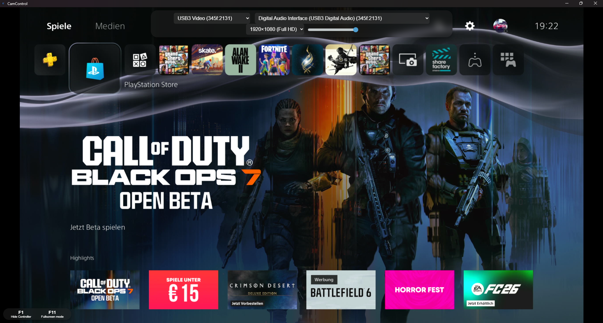

# 🎥 CamControl – Live Preview for Camera & Capture Feeds

**CamControl** is a lightweight Windows application that allows you to **preview video and audio inputs in real-time**.  
It’s perfect for users who want to monitor their **PC, console, or other video sources** without recording, all in **fullscreen mode**.



---

## 🚀 Features

- 🔌 **Multiple Video & Audio Sources**: Support for cameras, capture cards, and microphones  
- 🖥️ **Fullscreen Preview**: Ideal for gaming, streaming setups, or monitoring  
- 🖼️ **Custom Resolutions**: Adjust video quality to your preference  
- 🔊 **Real-Time Audio**: Supports microphone and line-in with volume control  
- 💡 **Minimalist Design**: Focus solely on your live feed, no unnecessary overlays  
- 🪟 **Windows Optimized**: Fast startup and lightweight  

---

## 🧩 How to Use

1. Download the Setup from [CamControl Download](http://e-development.net/CamControl/v1.0/CamControl%20Setup%201.0.0.exe)
2. Launch the application (`CamControl Setup.exe`).  
3. Select your camera or capture device.  
4. Choose your audio input (optional).  
5. Enjoy your live feed in fullscreen with synchronized audio.

---

## 🧑‍💻 For Developers / Contributors

```bash
git clone https://github.com/Erixn47/CamControl.git
cd CamControl
npm install
npm start
